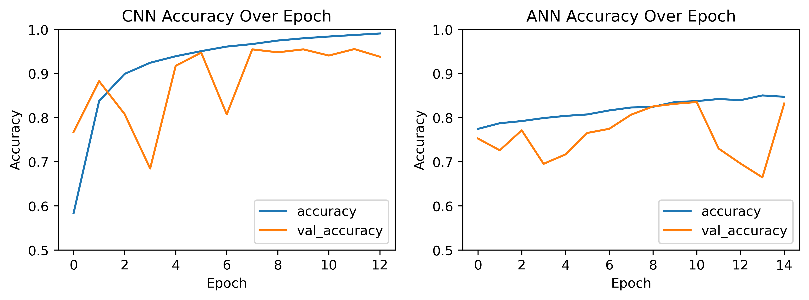
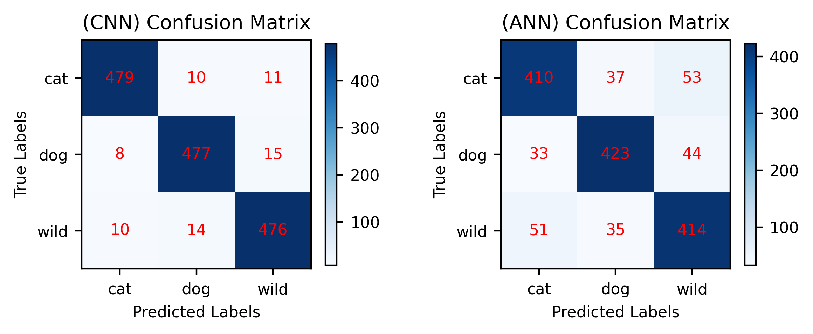
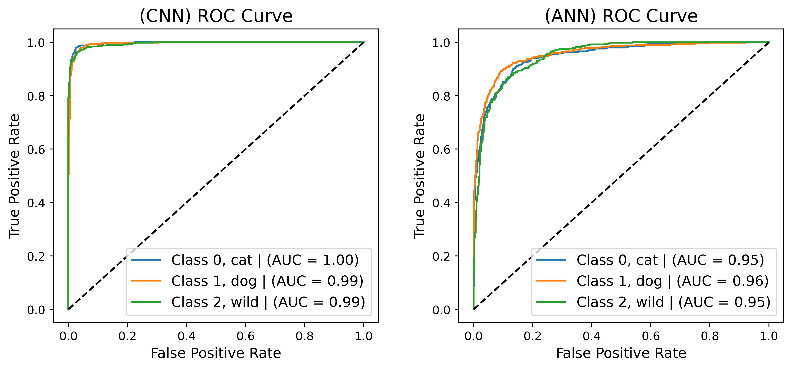
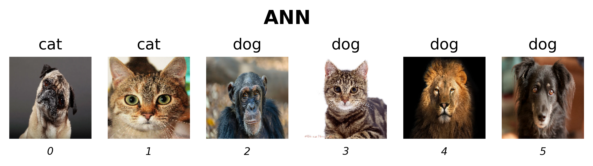

<br>

# <center>**Animal Faces Recognition<br>Using CNN and ANN Neural Networks**</center>

---

<center>Alfred Mastan <br>
    Department of Atmospheric and Oceanic Sciences, UCLA <br>
    AOS C111: Introduction to Machine Learning for the Physical Sciences <br>
    Dr. Alexander Lozinski
</center>

# **Introduction**

---

Classification Models:

Models:
* ANN (Artificial Neural Network - Forward Fully Connected)
* CNN (Convolutional Neural Network)

Metrics:
* Accuracy Over Epochs
* ROC (Receiver Operating Characteristic) - AUC (Area Under Curve)
* Precision-Recall Curve - AUC (Area Under Curve)
* F1 Score

  
Notes:
* Mention it that if i use 512x512 it will take to much time for the goal of this project and overkill
* It is hard to generalize for random images b/c background noise but otherwise still works well
* 

# **Data**

---

The data was originally provided from a research [**StarGAN v2: Diverse Image Synthesis for Multiple Domains**](https://github.com/clovaai/stargan-v2?tab=readme-ov-file) by *Yunjey Choi and Youngjung Uh and Jaejun Yoo and Jung-Woo Ha* in 2020. It was then posted on data science web platform [*Kaggle*](kaggle.com) by the username of *LARXEL* titled [**Animal Faces**](https://www.kaggle.com/datasets/andrewmvd/animal-faces)

The data contains *16,130* high-quality images with **512x512px** resolution that are already splitted evenly into 3 classes: **cat, dog, and wild**.

Furthermore, the data was neatly seperated for training and validation purposes containing *14,630* and *1,500* images, respectively.

Here are some images taken from the dataset from each class:
<div style="display: flex; flex-wrap: wrap; gap: 20px;">
    
    
    
</div>


# **Modelling**

---

## Data Preprocessing

Before the data being fed into the model, there are some preprocessing to do beforehand.
This was mostly done using `TensorFlow` datasets and `os` module to load the data from the computer.

Since the data is already seperated evenly between classes and between training and validation, we don't need to worry about imbalance data and splitting the data. The data was then loaded with the format as such:
* `integer` for the label (target variable)
  * 0: Cat
  * 1: Dog
  * 2: Wild
* `128x128` image resizing
  * Due to the limitation of computing power availabe on hand and time, rescaling the data down to 128x128 was the right choice without compromising the model accuracy later on
* `RGB` color mode
  * Ensuring that every images loaded was under `RGB` (Red Green Blue) color mode to prevent any mismatch that may happen
* `batching` of **32** images per batch
  * Since the data contains *16,130* images, batching was used for performance reasons

Furthermore, training data was *shuffled* to randomize the order of the data, while the validation data remains *unshuffled*.

Thus, the data was ready to be used for the model.


##### **Code**


```python
# Ignore annoying warnings
import warnings
warnings.filterwarnings('ignore') 
```


```python
import os
import matplotlib.pyplot as plt
import numpy as np
import tensorflow as tf
import keras
from keras import Sequential
from keras import layers
```


```python
## Data Preprocessing ##

# Load file paths and labels
current_folder_path = os.getcwd()
train_path = current_folder_path + '/afhq/train'
val_path = current_folder_path + '/afhq/val'

# Load images
img_size = (128, 128)
batch_size = 32

train_dataset = keras.preprocessing.image_dataset_from_directory(
    train_path,
    labels='inferred',
    label_mode='int', # {0: cat, 1: dog, 2: wild}
    color_mode='rgb',
    batch_size=batch_size,
    image_size=img_size,
    shuffle=True, # Enable shuffle for training data
    seed=1234
)

val_dataset = keras.preprocessing.image_dataset_from_directory(
    val_path,
    labels='inferred',
    label_mode='int', # {0: cat, 1: dog, 2: wild}
    color_mode='rgb',
    batch_size=batch_size,
    image_size=img_size,
    shuffle=False, # Disable shuffle for validation data
    seed=1234
)
```

    Found 14630 files belonging to 3 classes.
    Found 1500 files belonging to 3 classes.


## Neural Network Models

Two neural network models are being used for this project, **Convolutional Neural Network (CNN)** and **Artificial Neural Network (ANN)** as a classifier for the images. Both model was constructed using both `TensorFlow` and `Keras` modules.

### Convolutional Neural Network (CNN)

After numerous trial and errors, the *Convolution Neural Network (CNN)* are designed as such to compliment the available computing power:
* `Rescaling` layer as input layer to normalize the data for stability
* **3 Sets** of `Convolution` and `MaxPooling` layers with `relu` activation function
* `filter_shape` was set to **3x3**
* *Pooling* shape was set to **2x2** 
* Gradually increasing `filter_size` starting from **32** to **128**
* **128** neurons for the *fully-connected* layer with `relu` activation function
* `optimizer` using **Stochastic Gradient Descent (SGD)**
* `softmax` activation function for output layer as we have multiple classes

```python
# Variables for model
filter_shape = (3, 3)
class_names = val_dataset.class_names
num_classes = len(val_dataset.class_names)

# Create the model
model_cnn = Sequential([
    #Input Layer
    layers.Rescaling(scale=(1./255), input_shape=(128, 128, 3)),

    # First Block
    layers.Conv2D(32, filter_shape, activation='relu'),
    layers.MaxPooling2D((2, 2)),

    # Second Block
    layers.Conv2D(64, filter_shape, activation='relu'),
    layers.MaxPooling2D((2, 2)),

    # Third Block
    layers.Conv2D(128, filter_shape, activation='relu'),
    layers.MaxPooling2D((2, 2)),

    # Fully-Connected Layer
    layers.Flatten(),
    layers.Dense(128, activation='relu'),

    # Output Layer
    layers.Dense(num_classes, activation='softmax')
])

# Compile model for sparse labels
model_cnn.compile(
    optimizer='sgd',
    loss='sparse_categorical_crossentropy',  # For integer labels
    metrics=[keras.metrics.SparseCategoricalAccuracy(name='accuracy')]
)
```

The model finished trained for **13 epochs** using `EarlyStopping` with only **12.61 MB** in memory

**Should i put this in results?**

##### **Code**


```python
## CNN Model ##

# Variables for model
filter_shape = (3, 3)
class_names = val_dataset.class_names
num_classes = len(val_dataset.class_names)

# Create the model
model_cnn = Sequential([
    #Input Layer
    layers.Rescaling(scale=(1./255), input_shape=(128, 128, 3)),

    # First Block
    layers.Conv2D(32, filter_shape, activation='relu'),
    layers.MaxPooling2D((2, 2)),

    # Second Block
    layers.Conv2D(64, filter_shape, activation='relu'),
    layers.MaxPooling2D((2, 2)),

    # Third Block
    layers.Conv2D(128, filter_shape, activation='relu'),
    layers.MaxPooling2D((2, 2)),

    # Fully-Connected Layer
    layers.Flatten(),
    layers.Dense(128, activation='relu'),

    # Output Layer
    layers.Dense(num_classes, activation='softmax')
])

# Compile model for sparse labels
model_cnn.compile(
    optimizer='sgd',
    loss='sparse_categorical_crossentropy',  # For integer labels
    metrics=[keras.metrics.SparseCategoricalAccuracy(name='accuracy')]
)

# Print model summary
model_cnn.summary()
```


<pre style="white-space:pre;overflow-x:auto;line-height:normal;font-family:Menlo,'DejaVu Sans Mono',consolas,'Courier New',monospace"><span style="font-weight: bold">Model: "sequential_1"</span>
</pre>


<pre style="white-space:pre;overflow-x:auto;line-height:normal;font-family:Menlo,'DejaVu Sans Mono',consolas,'Courier New',monospace">┏━━━━━━━━━━━━━━━━━━━━━━━━━━━━━━━━━┳━━━━━━━━━━━━━━━━━━━━━━━━┳━━━━━━━━━━━━━━━┓
┃<span style="font-weight: bold"> Layer (type)                    </span>┃<span style="font-weight: bold"> Output Shape           </span>┃<span style="font-weight: bold">       Param # </span>┃
┡━━━━━━━━━━━━━━━━━━━━━━━━━━━━━━━━━╇━━━━━━━━━━━━━━━━━━━━━━━━╇━━━━━━━━━━━━━━━┩
│ rescaling_1 (<span style="color: #0087ff; text-decoration-color: #0087ff">Rescaling</span>)         │ (<span style="color: #00d7ff; text-decoration-color: #00d7ff">None</span>, <span style="color: #00af00; text-decoration-color: #00af00">128</span>, <span style="color: #00af00; text-decoration-color: #00af00">128</span>, <span style="color: #00af00; text-decoration-color: #00af00">3</span>)    │             <span style="color: #00af00; text-decoration-color: #00af00">0</span> │
├─────────────────────────────────┼────────────────────────┼───────────────┤
│ conv2d_3 (<span style="color: #0087ff; text-decoration-color: #0087ff">Conv2D</span>)               │ (<span style="color: #00d7ff; text-decoration-color: #00d7ff">None</span>, <span style="color: #00af00; text-decoration-color: #00af00">126</span>, <span style="color: #00af00; text-decoration-color: #00af00">126</span>, <span style="color: #00af00; text-decoration-color: #00af00">32</span>)   │           <span style="color: #00af00; text-decoration-color: #00af00">896</span> │
├─────────────────────────────────┼────────────────────────┼───────────────┤
│ max_pooling2d_3 (<span style="color: #0087ff; text-decoration-color: #0087ff">MaxPooling2D</span>)  │ (<span style="color: #00d7ff; text-decoration-color: #00d7ff">None</span>, <span style="color: #00af00; text-decoration-color: #00af00">63</span>, <span style="color: #00af00; text-decoration-color: #00af00">63</span>, <span style="color: #00af00; text-decoration-color: #00af00">32</span>)     │             <span style="color: #00af00; text-decoration-color: #00af00">0</span> │
├─────────────────────────────────┼────────────────────────┼───────────────┤
│ conv2d_4 (<span style="color: #0087ff; text-decoration-color: #0087ff">Conv2D</span>)               │ (<span style="color: #00d7ff; text-decoration-color: #00d7ff">None</span>, <span style="color: #00af00; text-decoration-color: #00af00">61</span>, <span style="color: #00af00; text-decoration-color: #00af00">61</span>, <span style="color: #00af00; text-decoration-color: #00af00">64</span>)     │        <span style="color: #00af00; text-decoration-color: #00af00">18,496</span> │
├─────────────────────────────────┼────────────────────────┼───────────────┤
│ max_pooling2d_4 (<span style="color: #0087ff; text-decoration-color: #0087ff">MaxPooling2D</span>)  │ (<span style="color: #00d7ff; text-decoration-color: #00d7ff">None</span>, <span style="color: #00af00; text-decoration-color: #00af00">30</span>, <span style="color: #00af00; text-decoration-color: #00af00">30</span>, <span style="color: #00af00; text-decoration-color: #00af00">64</span>)     │             <span style="color: #00af00; text-decoration-color: #00af00">0</span> │
├─────────────────────────────────┼────────────────────────┼───────────────┤
│ conv2d_5 (<span style="color: #0087ff; text-decoration-color: #0087ff">Conv2D</span>)               │ (<span style="color: #00d7ff; text-decoration-color: #00d7ff">None</span>, <span style="color: #00af00; text-decoration-color: #00af00">28</span>, <span style="color: #00af00; text-decoration-color: #00af00">28</span>, <span style="color: #00af00; text-decoration-color: #00af00">128</span>)    │        <span style="color: #00af00; text-decoration-color: #00af00">73,856</span> │
├─────────────────────────────────┼────────────────────────┼───────────────┤
│ max_pooling2d_5 (<span style="color: #0087ff; text-decoration-color: #0087ff">MaxPooling2D</span>)  │ (<span style="color: #00d7ff; text-decoration-color: #00d7ff">None</span>, <span style="color: #00af00; text-decoration-color: #00af00">14</span>, <span style="color: #00af00; text-decoration-color: #00af00">14</span>, <span style="color: #00af00; text-decoration-color: #00af00">128</span>)    │             <span style="color: #00af00; text-decoration-color: #00af00">0</span> │
├─────────────────────────────────┼────────────────────────┼───────────────┤
│ flatten_1 (<span style="color: #0087ff; text-decoration-color: #0087ff">Flatten</span>)             │ (<span style="color: #00d7ff; text-decoration-color: #00d7ff">None</span>, <span style="color: #00af00; text-decoration-color: #00af00">25088</span>)          │             <span style="color: #00af00; text-decoration-color: #00af00">0</span> │
├─────────────────────────────────┼────────────────────────┼───────────────┤
│ dense_2 (<span style="color: #0087ff; text-decoration-color: #0087ff">Dense</span>)                 │ (<span style="color: #00d7ff; text-decoration-color: #00d7ff">None</span>, <span style="color: #00af00; text-decoration-color: #00af00">128</span>)            │     <span style="color: #00af00; text-decoration-color: #00af00">3,211,392</span> │
├─────────────────────────────────┼────────────────────────┼───────────────┤
│ dense_3 (<span style="color: #0087ff; text-decoration-color: #0087ff">Dense</span>)                 │ (<span style="color: #00d7ff; text-decoration-color: #00d7ff">None</span>, <span style="color: #00af00; text-decoration-color: #00af00">3</span>)              │           <span style="color: #00af00; text-decoration-color: #00af00">387</span> │
└─────────────────────────────────┴────────────────────────┴───────────────┘
</pre>


<pre style="white-space:pre;overflow-x:auto;line-height:normal;font-family:Menlo,'DejaVu Sans Mono',consolas,'Courier New',monospace"><span style="font-weight: bold"> Total params: </span><span style="color: #00af00; text-decoration-color: #00af00">3,305,027</span> (12.61 MB)
</pre>


<pre style="white-space:pre;overflow-x:auto;line-height:normal;font-family:Menlo,'DejaVu Sans Mono',consolas,'Courier New',monospace"><span style="font-weight: bold"> Trainable params: </span><span style="color: #00af00; text-decoration-color: #00af00">3,305,027</span> (12.61 MB)
</pre>


<pre style="white-space:pre;overflow-x:auto;line-height:normal;font-family:Menlo,'DejaVu Sans Mono',consolas,'Courier New',monospace"><span style="font-weight: bold"> Non-trainable params: </span><span style="color: #00af00; text-decoration-color: #00af00">0</span> (0.00 B)
</pre>


**Model Training**


```python
%%time
## Train CNN Model ##

## Set Early Stopping to prevent unnecessary Epoch run
early_stopping = keras.callbacks.EarlyStopping(monitor='val_loss', patience=3, restore_best_weights=True)

history_cnn = model_cnn.fit(
    train_dataset,
    validation_data=val_dataset,
    epochs=20,
    callbacks=[early_stopping],
)

# Save and load model for future tests
# model_cnn.save('model_cnn.keras')
```

    Epoch 1/20
    458/458 ━━━━━━━━━━━━━━━━━━━━ 66s 145ms/step - accuracy: 0.4828 - loss: 1.0008 - val_accuracy: 0.7673 - val_loss: 0.6263
    Epoch 2/20
    458/458 ━━━━━━━━━━━━━━━━━━━━ 74s 161ms/step - accuracy: 0.8013 - loss: 0.5299 - val_accuracy: 0.8827 - val_loss: 0.3157
    Epoch 3/20
    458/458 ━━━━━━━━━━━━━━━━━━━━ 77s 168ms/step - accuracy: 0.8878 - loss: 0.3016 - val_accuracy: 0.8080 - val_loss: 0.4490
    Epoch 4/20
    458/458 ━━━━━━━━━━━━━━━━━━━━ 90s 197ms/step - accuracy: 0.9189 - loss: 0.2163 - val_accuracy: 0.6847 - val_loss: 0.7347
    Epoch 5/20
    458/458 ━━━━━━━━━━━━━━━━━━━━ 93s 203ms/step - accuracy: 0.9298 - loss: 0.1863 - val_accuracy: 0.9173 - val_loss: 0.2248
    Epoch 6/20
    458/458 ━━━━━━━━━━━━━━━━━━━━ 104s 226ms/step - accuracy: 0.9477 - loss: 0.1393 - val_accuracy: 0.9473 - val_loss: 0.1597
    Epoch 7/20
    458/458 ━━━━━━━━━━━━━━━━━━━━ 92s 202ms/step - accuracy: 0.9599 - loss: 0.1129 - val_accuracy: 0.8073 - val_loss: 0.6083
    Epoch 8/20
    458/458 ━━━━━━━━━━━━━━━━━━━━ 101s 220ms/step - accuracy: 0.9623 - loss: 0.1125 - val_accuracy: 0.9547 - val_loss: 0.1350
    Epoch 9/20
    458/458 ━━━━━━━━━━━━━━━━━━━━ 98s 214ms/step - accuracy: 0.9727 - loss: 0.0772 - val_accuracy: 0.9480 - val_loss: 0.1504
    Epoch 10/20
    458/458 ━━━━━━━━━━━━━━━━━━━━ 96s 209ms/step - accuracy: 0.9784 - loss: 0.0620 - val_accuracy: 0.9547 - val_loss: 0.1264
    Epoch 11/20
    458/458 ━━━━━━━━━━━━━━━━━━━━ 100s 218ms/step - accuracy: 0.9833 - loss: 0.0517 - val_accuracy: 0.9407 - val_loss: 0.1878
    Epoch 12/20
    458/458 ━━━━━━━━━━━━━━━━━━━━ 100s 217ms/step - accuracy: 0.9868 - loss: 0.0427 - val_accuracy: 0.9553 - val_loss: 0.1301
    Epoch 13/20
    458/458 ━━━━━━━━━━━━━━━━━━━━ 103s 226ms/step - accuracy: 0.9896 - loss: 0.0329 - val_accuracy: 0.9380 - val_loss: 0.2072
    CPU times: user 1h 57min 56s, sys: 9min 8s, total: 2h 7min 5s
    Wall time: 19min 53s


### Artificial Neural Network (ANN)

For the same reason, the *Artificial Neural Network (ANN*) model is designed as such:
* `Rescaling` layer as input layer to normalize the data for stability
* **3** *hidden layers* with decreasing neurons from **1024** to **256**
* `Dropout` layer with **0.3** strength is used in each hidden layer to combat overfitting
* `optimizer` using **Stochastic Gradient Descent (SGD)**

```python
# Create the model
model_ann = Sequential([
    # Input Layer
    layers.Rescaling(scale=(1./255), input_shape=(128, 128, 3)),
    layers.Flatten(),

    # First Hidden Layer
    layers.Dense(1024, activation='relu'),
    layers.Dropout(0.3),

    # Second Hidden Layer
    layers.Dense(512, activation='relu'),
    layers.Dropout(0.3),

    # Third Hidden Layer
    layers.Dense(256, activation='relu'),
    layers.Dropout(0.3),

    # Output Layer
    layers.Dense(num_classes, activation='softmax')
])

# Compile model for sparse labels
model_ann.compile(
    optimizer='sgd',
    loss='sparse_categorical_crossentropy',  # For integer labels
    metrics=[keras.metrics.SparseCategoricalAccuracy(name='accuracy')]
)
```

The model finished trained for **15 epochs** using `EarlyStopping` with only **194.51 MB** in memory 

**Should i put this in results?**

##### **Code**


```python
## Neural Network Modelling ##

from keras.regularizers import l2

# Create the model
model_ann = Sequential([
    # Input Layer
    layers.Rescaling(scale=(1./255), input_shape=(128, 128, 3)),
    layers.Flatten(),

    # First Hidden Layer
    layers.Dense(1024, activation='relu'),
    layers.Dropout(0.3),

    # Second Hidden Layer
    layers.Dense(512, activation='relu'),
    layers.Dropout(0.3),

    # Third Hidden Layer
    layers.Dense(256, activation='relu'),
    layers.Dropout(0.3),

    # Output Layer
    layers.Dense(num_classes, activation='softmax')
])

# Compile model for sparse labels
model_ann.compile(
    optimizer='sgd',
    loss='sparse_categorical_crossentropy',  # For integer labels
    metrics=[keras.metrics.SparseCategoricalAccuracy(name='accuracy')]
)

# Print model summary
model_ann.summary()
```


<pre style="white-space:pre;overflow-x:auto;line-height:normal;font-family:Menlo,'DejaVu Sans Mono',consolas,'Courier New',monospace"><span style="font-weight: bold">Model: "sequential_2"</span>
</pre>


<pre style="white-space:pre;overflow-x:auto;line-height:normal;font-family:Menlo,'DejaVu Sans Mono',consolas,'Courier New',monospace">┏━━━━━━━━━━━━━━━━━━━━━━━━━━━━━━━━━┳━━━━━━━━━━━━━━━━━━━━━━━━┳━━━━━━━━━━━━━━━┓
┃<span style="font-weight: bold"> Layer (type)                    </span>┃<span style="font-weight: bold"> Output Shape           </span>┃<span style="font-weight: bold">       Param # </span>┃
┡━━━━━━━━━━━━━━━━━━━━━━━━━━━━━━━━━╇━━━━━━━━━━━━━━━━━━━━━━━━╇━━━━━━━━━━━━━━━┩
│ rescaling_2 (<span style="color: #0087ff; text-decoration-color: #0087ff">Rescaling</span>)         │ (<span style="color: #00d7ff; text-decoration-color: #00d7ff">None</span>, <span style="color: #00af00; text-decoration-color: #00af00">128</span>, <span style="color: #00af00; text-decoration-color: #00af00">128</span>, <span style="color: #00af00; text-decoration-color: #00af00">3</span>)    │             <span style="color: #00af00; text-decoration-color: #00af00">0</span> │
├─────────────────────────────────┼────────────────────────┼───────────────┤
│ flatten_2 (<span style="color: #0087ff; text-decoration-color: #0087ff">Flatten</span>)             │ (<span style="color: #00d7ff; text-decoration-color: #00d7ff">None</span>, <span style="color: #00af00; text-decoration-color: #00af00">49152</span>)          │             <span style="color: #00af00; text-decoration-color: #00af00">0</span> │
├─────────────────────────────────┼────────────────────────┼───────────────┤
│ dense_4 (<span style="color: #0087ff; text-decoration-color: #0087ff">Dense</span>)                 │ (<span style="color: #00d7ff; text-decoration-color: #00d7ff">None</span>, <span style="color: #00af00; text-decoration-color: #00af00">1024</span>)           │    <span style="color: #00af00; text-decoration-color: #00af00">50,332,672</span> │
├─────────────────────────────────┼────────────────────────┼───────────────┤
│ dropout (<span style="color: #0087ff; text-decoration-color: #0087ff">Dropout</span>)               │ (<span style="color: #00d7ff; text-decoration-color: #00d7ff">None</span>, <span style="color: #00af00; text-decoration-color: #00af00">1024</span>)           │             <span style="color: #00af00; text-decoration-color: #00af00">0</span> │
├─────────────────────────────────┼────────────────────────┼───────────────┤
│ dense_5 (<span style="color: #0087ff; text-decoration-color: #0087ff">Dense</span>)                 │ (<span style="color: #00d7ff; text-decoration-color: #00d7ff">None</span>, <span style="color: #00af00; text-decoration-color: #00af00">512</span>)            │       <span style="color: #00af00; text-decoration-color: #00af00">524,800</span> │
├─────────────────────────────────┼────────────────────────┼───────────────┤
│ dropout_1 (<span style="color: #0087ff; text-decoration-color: #0087ff">Dropout</span>)             │ (<span style="color: #00d7ff; text-decoration-color: #00d7ff">None</span>, <span style="color: #00af00; text-decoration-color: #00af00">512</span>)            │             <span style="color: #00af00; text-decoration-color: #00af00">0</span> │
├─────────────────────────────────┼────────────────────────┼───────────────┤
│ dense_6 (<span style="color: #0087ff; text-decoration-color: #0087ff">Dense</span>)                 │ (<span style="color: #00d7ff; text-decoration-color: #00d7ff">None</span>, <span style="color: #00af00; text-decoration-color: #00af00">256</span>)            │       <span style="color: #00af00; text-decoration-color: #00af00">131,328</span> │
├─────────────────────────────────┼────────────────────────┼───────────────┤
│ dropout_2 (<span style="color: #0087ff; text-decoration-color: #0087ff">Dropout</span>)             │ (<span style="color: #00d7ff; text-decoration-color: #00d7ff">None</span>, <span style="color: #00af00; text-decoration-color: #00af00">256</span>)            │             <span style="color: #00af00; text-decoration-color: #00af00">0</span> │
├─────────────────────────────────┼────────────────────────┼───────────────┤
│ dense_7 (<span style="color: #0087ff; text-decoration-color: #0087ff">Dense</span>)                 │ (<span style="color: #00d7ff; text-decoration-color: #00d7ff">None</span>, <span style="color: #00af00; text-decoration-color: #00af00">3</span>)              │           <span style="color: #00af00; text-decoration-color: #00af00">771</span> │
└─────────────────────────────────┴────────────────────────┴───────────────┘
</pre>


<pre style="white-space:pre;overflow-x:auto;line-height:normal;font-family:Menlo,'DejaVu Sans Mono',consolas,'Courier New',monospace"><span style="font-weight: bold"> Total params: </span><span style="color: #00af00; text-decoration-color: #00af00">50,989,571</span> (194.51 MB)
</pre>


<pre style="white-space:pre;overflow-x:auto;line-height:normal;font-family:Menlo,'DejaVu Sans Mono',consolas,'Courier New',monospace"><span style="font-weight: bold"> Trainable params: </span><span style="color: #00af00; text-decoration-color: #00af00">50,989,571</span> (194.51 MB)
</pre>


<pre style="white-space:pre;overflow-x:auto;line-height:normal;font-family:Menlo,'DejaVu Sans Mono',consolas,'Courier New',monospace"><span style="font-weight: bold"> Non-trainable params: </span><span style="color: #00af00; text-decoration-color: #00af00">0</span> (0.00 B)
</pre>


**Model Training**


```python
%%time
## Train ANN Model ##

## Set Early Stopping to prevent unnecessary Epoch run
early_stopping = keras.callbacks.EarlyStopping(monitor='val_loss', patience=5, restore_best_weights=True)

history_ann = model_ann.fit(
    train_dataset,
    validation_data=val_dataset,
    epochs=20,
    callbacks=[early_stopping],
)

# Save and load model for future tests
# model_ann.save('model_ann.keras')
```

    Epoch 1/20
    458/458 ━━━━━━━━━━━━━━━━━━━━ 27s 59ms/step - accuracy: 0.7703 - loss: 0.5633 - val_accuracy: 0.7527 - val_loss: 0.5831
    Epoch 2/20
    458/458 ━━━━━━━━━━━━━━━━━━━━ 29s 62ms/step - accuracy: 0.7859 - loss: 0.5367 - val_accuracy: 0.7260 - val_loss: 0.6429
    Epoch 3/20
    458/458 ━━━━━━━━━━━━━━━━━━━━ 31s 67ms/step - accuracy: 0.7914 - loss: 0.5328 - val_accuracy: 0.7713 - val_loss: 0.5546
    Epoch 4/20
    458/458 ━━━━━━━━━━━━━━━━━━━━ 32s 69ms/step - accuracy: 0.7966 - loss: 0.5014 - val_accuracy: 0.6953 - val_loss: 0.6545
    Epoch 5/20
    458/458 ━━━━━━━━━━━━━━━━━━━━ 37s 80ms/step - accuracy: 0.8021 - loss: 0.4994 - val_accuracy: 0.7167 - val_loss: 0.6451
    Epoch 6/20
    458/458 ━━━━━━━━━━━━━━━━━━━━ 41s 90ms/step - accuracy: 0.8045 - loss: 0.4847 - val_accuracy: 0.7653 - val_loss: 0.5796
    Epoch 7/20
    458/458 ━━━━━━━━━━━━━━━━━━━━ 39s 85ms/step - accuracy: 0.8140 - loss: 0.4720 - val_accuracy: 0.7747 - val_loss: 0.5410
    Epoch 8/20
    458/458 ━━━━━━━━━━━━━━━━━━━━ 40s 88ms/step - accuracy: 0.8222 - loss: 0.4578 - val_accuracy: 0.8067 - val_loss: 0.4842
    Epoch 9/20
    458/458 ━━━━━━━━━━━━━━━━━━━━ 41s 90ms/step - accuracy: 0.8278 - loss: 0.4479 - val_accuracy: 0.8253 - val_loss: 0.4321
    Epoch 10/20
    458/458 ━━━━━━━━━━━━━━━━━━━━ 40s 88ms/step - accuracy: 0.8347 - loss: 0.4330 - val_accuracy: 0.8313 - val_loss: 0.4255
    Epoch 11/20
    458/458 ━━━━━━━━━━━━━━━━━━━━ 38s 82ms/step - accuracy: 0.8375 - loss: 0.4209 - val_accuracy: 0.8353 - val_loss: 0.4311
    Epoch 12/20
    458/458 ━━━━━━━━━━━━━━━━━━━━ 36s 79ms/step - accuracy: 0.8421 - loss: 0.4112 - val_accuracy: 0.7300 - val_loss: 0.6852
    Epoch 13/20
    458/458 ━━━━━━━━━━━━━━━━━━━━ 40s 88ms/step - accuracy: 0.8413 - loss: 0.4039 - val_accuracy: 0.6960 - val_loss: 0.7968
    Epoch 14/20
    458/458 ━━━━━━━━━━━━━━━━━━━━ 37s 80ms/step - accuracy: 0.8475 - loss: 0.3990 - val_accuracy: 0.6647 - val_loss: 0.9499
    Epoch 15/20
    458/458 ━━━━━━━━━━━━━━━━━━━━ 37s 81ms/step - accuracy: 0.8451 - loss: 0.4093 - val_accuracy: 0.8320 - val_loss: 0.4480
    CPU times: user 42min 9s, sys: 9min 35s, total: 51min 45s
    Wall time: 9min 4s


# Results

---

Each model was trained accordingly, with an accuracy of **95.47%** for the CNN model and **83.13%** for the ANN model. The CNN model stopped after **13 epochs** using `EarlyStopping` on *validation loss*. Similarly, the ANN model stopped after **15 epochs** using the same `EarlyStopping` method. The accuracy for both models over epoch plotted below:


*Figure 1. Accuracy Over Epoch for CNN and ANN*

##### **Code**


```python
# Load existing model
model_cnn = keras.models.load_model('model_cnn.keras')
model_ann = keras.models.load_model('model_ann.keras')
```


```python
# Evaluate CNN Model
test_loss_cnn, test_accuracy_cnn = model_cnn.evaluate(val_dataset)
print(f"CNN Test Accuracy: {test_accuracy_cnn * 100:.2f}%")

# Evaluate ANN Model
test_loss_ann, test_accuracy_ann = model_ann.evaluate(val_dataset)
print(f"ANN Test Accuracy: {test_accuracy_ann * 100:.2f}%")
```

    47/47 ━━━━━━━━━━━━━━━━━━━━ 2s 47ms/step - accuracy: 0.9633 - loss: 0.1047
    CNN Test Accuracy: 95.47%
    47/47 ━━━━━━━━━━━━━━━━━━━━ 1s 23ms/step - accuracy: 0.8246 - loss: 0.4161
    ANN Test Accuracy: 83.13%


```python
## To load the history from saved training data
## Change remove ".history" if used

# history_cnn = np.load('cnn_train_history.npy', allow_pickle='TRUE').item()
# history_ann = np.load('ann_train_history.npy', allow_pickle='TRUE').item()
```


```python
fig, axes = plt.subplots(1, 2, dpi=400, figsize=(10,3))

axes[0].plot(history_cnn.history['accuracy'], label='accuracy')
axes[0].plot(history_cnn.history['val_accuracy'], label = 'val_accuracy')
axes[0].set_xlabel('Epoch')
axes[0].set_ylabel('Accuracy')
axes[0].set_ylim([0.5, 1])
axes[0].legend(loc='lower right')
axes[0].set_title('CNN Accuracy Over Epoch');

axes[1].plot(history_ann.history['accuracy'], label='accuracy')
axes[1].plot(history_ann.history['val_accuracy'], label = 'val_accuracy')
axes[1].set_xlabel('Epoch')
axes[1].set_ylabel('Accuracy')
axes[1].set_ylim([0.5, 1])
axes[1].legend(loc='lower right')
axes[1].set_title('ANN Accuracy Over Epoch');
fig.savefig('model_over_epoch.png')
```


    

    


### Confusion Matrix

To further evaluate the model, confusion matrix were plotted to better view how both models perform


*Figure 2. Confusion Matrix for CNN and ANN*

asdasd

##### **Code**


```python
# CNN
labels_true_cnn = []  # True labels
labels_pred_cnn = []  # Predicted labels

for images, labels in val_dataset:
    predictions = model_cnn.predict(images, verbose=0)
    labels_pred_cnn.extend(predictions)  # Get predicted class indices
    labels_true_cnn.extend(labels.numpy())  # Append true labels

# ANN
labels_true_ann = []  # True labels
labels_pred_ann = []  # Predicted labels

for images, labels in val_dataset:
    predictions = model_ann.predict(images, verbose=0)
    labels_pred_ann.extend(predictions)  # Get predicted class indices
    labels_true_ann.extend(labels.numpy())  # Append true labels
```

    2024-11-29 13:14:50.602208: I tensorflow/core/framework/local_rendezvous.cc:404] Local rendezvous is aborting with status: OUT_OF_RANGE: End of sequence


```python
# Generate the confusion matrices
conf_matrix_cnn = tf.math.confusion_matrix(labels_true_cnn, np.argmax(labels_pred_cnn, axis=1))
conf_matrix_ann = tf.math.confusion_matrix(labels_true_ann, np.argmax(labels_pred_ann, axis=1))

fig, axes = plt.subplots(1, 2, dpi=400)
fontsize = 8

# Plot the confusion matrix for CNN
im1 = axes[0].imshow(conf_matrix_cnn, cmap='Blues')
axes[0].set_title("(CNN) Confusion Matrix", fontsize=10)
axes[0].set_xlabel("Predicted Labels", fontsize=fontsize)
axes[0].set_ylabel("True Labels", fontsize=fontsize)
axes[0].set_xticks(range(len(class_names)), class_names, fontsize=fontsize)
axes[0].set_yticks(range(len(class_names)), class_names, fontsize=fontsize)
cbar = fig.colorbar(im1, ax=axes[0], shrink=0.4)
cbar.ax.tick_params(labelsize=fontsize)

# Annotate the cells
for i in range(len(class_names)):
    for j in range(len(class_names)):
        axes[0].text(j, i, conf_matrix_cnn[i, j].numpy(), ha='center', va='center', color='red', fontsize=fontsize)

# Plot the confusion matrix for ANN
im2 = axes[1].imshow(conf_matrix_ann, cmap='Blues')
axes[1].set_title("(ANN) Confusion Matrix", fontsize=10)
axes[1].set_xlabel("Predicted Labels", fontsize=fontsize)
axes[1].set_ylabel("True Labels", fontsize=fontsize)
axes[1].set_xticks(range(len(class_names)), class_names, fontsize=fontsize)
axes[1].set_yticks(range(len(class_names)), class_names, fontsize=fontsize)
cbar = fig.colorbar(im2, ax=axes[1], shrink=0.4)
cbar.ax.tick_params(labelsize=fontsize)
fig.tight_layout(pad=3.0)

# Annotate the cells
for i in range(len(class_names)):
    for j in range(len(class_names)):
        axis[1].text(j, i, conf_matrix_ann[i, j].numpy(), ha='center', va='center', color='red', fontsize=fontsize)
```


    

    


### ROC Curve

Models ROC (Receiver Operating Characteristic) - AUC (Area Under Curve)


*Figure 3. ROC Curve for CNN and ANN*

##### **Code**


```python
from sklearn.metrics import roc_curve, auc

# Convert to one-hot encoding for metrics
labels_true_cnn_one_hot = keras.utils.to_categorical(labels_true_cnn, num_classes=len(class_names))
labels_true_ann_one_hot = keras.utils.to_categorical(labels_true_ann, num_classes=len(class_names))

# Convert to numpy arrays
labels_pred_cnn = np.array(labels_pred_cnn)
labels_pred_ann = np.array(labels_pred_ann)

# Plot
fontsize = 12
fig, axes = plt.subplots(1, 2, dpi=400, figsize=(10, 5))

# Loop through each class for one-vs-all ROC curves
# CNN
for i in range(num_classes):
    fpr, tpr, _ = roc_curve(labels_true_cnn_one_hot[:, i], labels_pred_cnn[:, i])
    roc_auc = auc(fpr, tpr)
    axes[0].plot(fpr, tpr, label=f"Class {i}, {class_names[i]} | (AUC = {roc_auc:.2f})")

# ANN
for i in range(num_classes):
    fpr, tpr, _ = roc_curve(labels_true_ann_one_hot[:, i], labels_pred_ann[:, i])
    roc_auc = auc(fpr, tpr)
    axes[1].plot(fpr, tpr, label=f"Class {i}, {class_names[i]} | (AUC = {roc_auc:.2f})")

# Plot diagonal line
axes[0].plot([0, 1], [0, 1], 'k--')
axes[0].set_title("(CNN) ROC Curve", fontsize=15)
axes[0].set_xlabel("False Positive Rate", fontsize=fontsize)
axes[0].set_ylabel("True Positive Rate", fontsize=fontsize)
axes[0].legend(loc="best", fontsize=fontsize)

axes[1].plot([0, 1], [0, 1], 'k--')
axes[1].set_title("(ANN) ROC Curve", fontsize=15)
axes[1].set_xlabel("False Positive Rate", fontsize=fontsize)
axes[1].set_ylabel("True Positive Rate", fontsize=fontsize)
axes[1].legend(loc="best", fontsize=fontsize)
fig.tight_layout(pad=3.0)
```


    

    


### Models Precision-Recall Curve

AuC


*Figure 4. Precision-Recall Curve for CNN and ANN*

##### **Code**


```python
from sklearn.metrics import precision_recall_curve, average_precision_score

fontsize = 12
fig, axes = plt.subplots(1, 2, dpi=400, figsize=(10, 5))

# Loop through each class for one-vs-all PR curves
# CNN
for i in range(num_classes):
    precision, recall, _ = precision_recall_curve(labels_true_cnn_one_hot[:, i], labels_pred_cnn[:, i])
    pr_auc = average_precision_score(labels_true_cnn_one_hot[:, i], labels_pred_cnn[:, i])
    axes[0].plot(recall, precision, label=f"Class {i}, {class_names[i]} | (AUC = {pr_auc:.2f})")

#ANN
for i in range(num_classes):
    precision, recall, _ = precision_recall_curve(labels_true_ann_one_hot[:, i], labels_pred_ann[:, i])
    pr_auc = average_precision_score(labels_true_ann_one_hot[:, i], labels_pred_ann[:, i])
    axes[1].plot(recall, precision, label=f"Class {i}, {class_names[i]} | (AUC = {pr_auc:.2f})")

axes[0].set_title("(CNN) Precision-Recall Curve", fontsize=15)
axes[0].set_xlabel("Recall", fontsize=fontsize)
axes[0].set_ylabel("Precision", fontsize=fontsize)
axes[0].legend(loc="best", fontsize=fontsize);

axes[1].set_title("(ANN) Precision-Recall Curve", fontsize=15)
axes[1].set_xlabel("Recall", fontsize=fontsize)
axes[1].set_ylabel("Precision", fontsize=fontsize)
axes[1].legend(loc="best", fontsize=fontsize);
fig.tight_layout(pad=3.0)

```


    

    


### Models Classification Report

asda

**<center>CNN Classification Report</center>**
Remove Precision and REcall?
|            |precision|recall   |f1-score   |support
|------------|---------|---------|-----------|--------
|cat         |0.96     |0.96     |0.96       |500
|dog         |0.95     |0.95     |0.95       |500
|wild        |0.95     |0.95     |0.95       |500
|
|accuracy    |         |         |0.95       |1500
|macro avg   |0.95     |0.95     |0.95       |1500
|weighted avg|0.95     |0.95     |0.95       |1500

*Table 1. Classification Report for CNN*

**<center>ANN Classification Report</center>**
|            |precision|recall   |f1-score   |support
|------------|---------|---------|-----------|--------
|cat         |0.83     |0.82     |0.82       |500
|dog         |0.85     |0.85     |0.85       |500
|wild        |0.81     |0.83     |0.82       |500
|
|accuracy    |         |         |0.83       |1500
|macro avg   |0.83     |0.83     |0.83       |1500
|weighted avg|0.83     |0.83     |0.83       |1500

*Table 2. Classification Report for ANN*

##### **Code**


```python
from sklearn.metrics import classification_report
report_cnn = classification_report(labels_true_cnn, np.argmax(labels_pred_cnn, axis=1), target_names=class_names)
report_ann = classification_report(labels_true_ann, np.argmax(labels_pred_ann, axis=1), target_names=class_names)
print(report_cnn)
print()
print(report_ann)
```

                  precision    recall  f1-score   support
    
             cat       0.96      0.96      0.96       500
             dog       0.95      0.95      0.95       500
            wild       0.95      0.95      0.95       500
    
        accuracy                           0.95      1500
       macro avg       0.95      0.95      0.95      1500
    weighted avg       0.95      0.95      0.95      1500
    
    
                  precision    recall  f1-score   support
    
             cat       0.83      0.82      0.82       500
             dog       0.85      0.85      0.85       500
            wild       0.81      0.83      0.82       500
    
        accuracy                           0.83      1500
       macro avg       0.83      0.83      0.83      1500
    weighted avg       0.83      0.83      0.83      1500
    


# Discussion

---

Testing Models to outside data from the internet

Wrong Prediction: 2

Different Prediction: 0, 3, 4

Correct Prediction: 5


*Figure 5. Model Testing Results with CNN and ANN*

##### **Code**


```python
from keras.utils import load_img, img_to_array

# Get file 
current_folder_path = os.getcwd()
data_path = current_folder_path + '/test_data_3/'

# Plot test pictures
data_dir = os.listdir(data_path)
if os.path.exists(data_path+'/.DS_Store'):
    data_dir.remove('.DS_Store') # Remove .DS_Store file

# CNN
fig, axes = plt.subplots(1, len(data_dir), figsize=(8, 8), dpi=400)
fig.suptitle('CNN', y=0.5, fontsize=15, fontweight='bold')
fig.subplots_adjust(top=0.65)

for i, file_name in enumerate(data_dir):
    img_path = os.path.join(data_path, file_name) # Get every file in the path folder
    img = load_img(img_path, target_size=img_size) # Load and resize to (128, 128)
    img_array = np.expand_dims(img, axis=0)  # Add batch dimension

    predictions = model_cnn.predict(img_array, verbose=0) # Predict using model
    predicted_class = np.argmax(predictions)

    #Extra text plotting
    axes[i].imshow(img)
    axes[i].set_axis_off()
    axes[i].set_title(class_names[predicted_class])
    axes[i].text(0.5, -0.1, f"{(i)}", ha='center', va='top', style='italic', fontsize=8, transform=axes[i].transAxes)

# ANN
fig, axes = plt.subplots(1, len(data_dir), figsize=(8, 8), dpi=400)
fig.suptitle('ANN', y=0.5, fontsize=15, fontweight='bold')
fig.subplots_adjust(top=0.65)

for i, file_name in enumerate(data_dir):
    img_path = os.path.join(data_path, file_name) # Get every file in the path folder
    img = load_img(img_path, target_size=img_size) # Load and resize to (128, 128)
    img_array = np.expand_dims(img, axis=0)  # Add batch dimension
    
    predictions = model_ann.predict(img_array, verbose=0)
    predicted_class = np.argmax(predictions)

    #Extra text plotting
    axes[i].imshow(img)
    axes[i].set_axis_off()
    axes[i].set_title(class_names[predicted_class])
    axes[i].text(0.5, -0.1, f"{(i)}", ha='center', va='top', style='italic', fontsize=8, transform=axes[i].transAxes)
```


    

    


    

    


```python

```


```python

```


```python

```

# Conclusion

---

So blablablablablabla

# References / Citations / Bibliography

---

[1] KittySensations, "Animal Face," *Pinterest*. Available: www.pinterest.com/pin/603271312566584729/. Accessed: Nov. 29, 2024.

[2] "Tabby Cat's Face," *Warren Photographic*. Available: www.warrenphotographic.co.uk/02395-tabby-cats-face. Accessed: Nov. 29, 2024.

[3] C. Nguyen, "Black Dog Staring at the Camera," *Unsplash*, Published: Oct. 15, 2017. Available: https://unsplash.com/photos/black-dog-staring-at-the-camera-DKHnBJyWCQ8. Accessed: Nov. 29, 2024.

[4] S. Mironenko, "Lion King Isolated on Black," *Adobe Stock*. Available: https://as2.ftcdn.net/v2/jpg/01/35/97/83/1000_F_135978399_qplk3WPu7JOA63JPCYVy1fb7MI4nefAL.jpg. Accessed: Nov. 29, 2024.

[5] Damien, "Chimpanzee Looking Towards Camera," *Adobe Stock*. Available: https://as1.ftcdn.net/v2/jpg/08/10/07/84/1000_F_810078457_c0Gmu5C1O6dMi9eD6HVmg87pjbTZ8MZk.jpg. Accessed: Nov. 29, 2024.

[6] M. Lorenz, "Fawn Pug," *Getty Images*. Available: www.gettyimages.com/detail/photo/fawn-pug-royalty-free-image/144815824. Accessed: Nov. 29, 2024.

[7] Y. Choi, Y. Uh, J. Yoo, and J.-W. Ha, *"StarGAN v2: Diverse Image Synthesis for Multiple Domains,"* in *Proceedings of the IEEE/CVF Conference on Computer Vision and Pattern Recognition (CVPR)*, 2020. Available: https://github.com/clovaai/stargan-v2?tab=readme-ov-file. Accessed: Nov. 29, 2024.


```python

```
