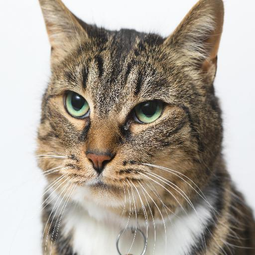
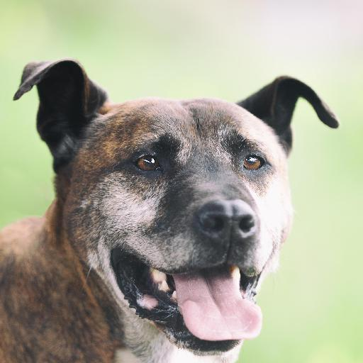
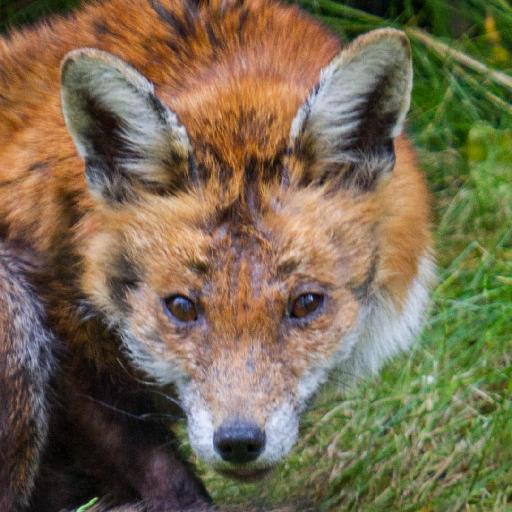
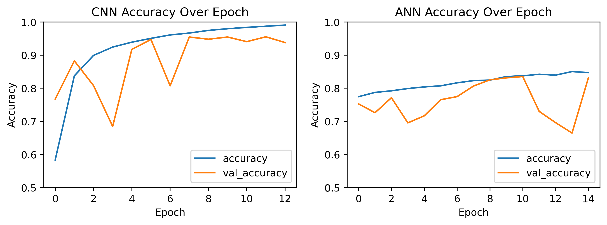
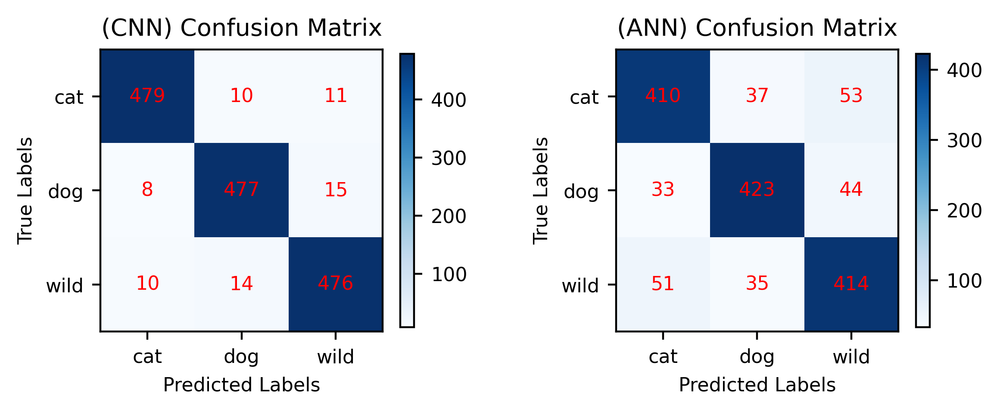
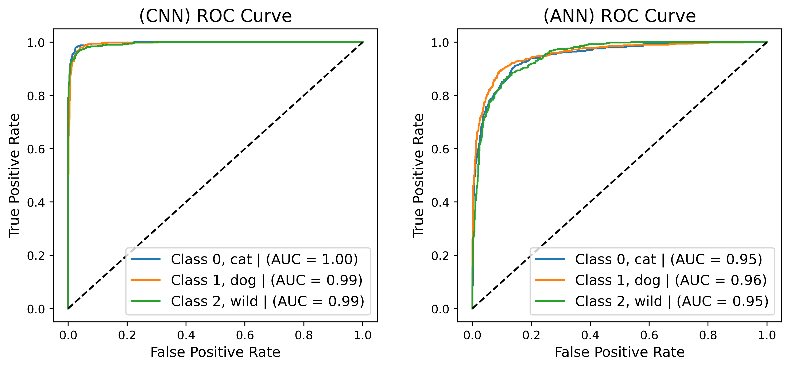
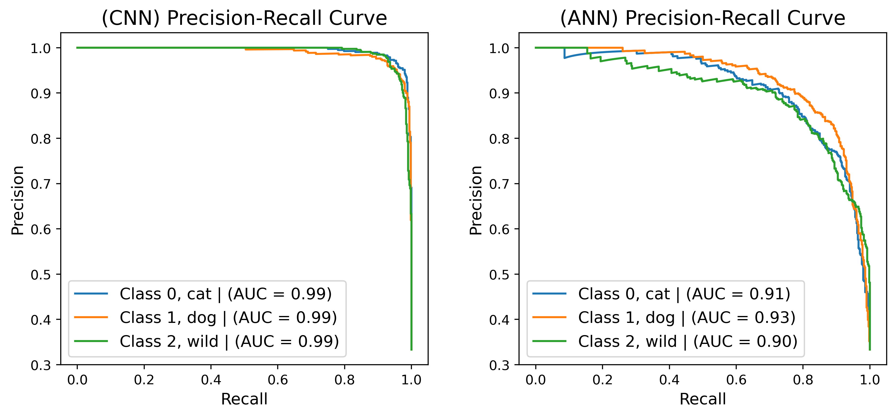
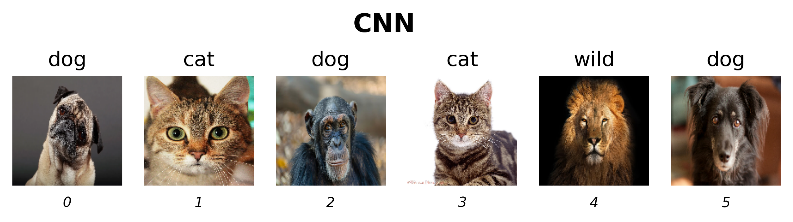

<br>
<h2 align='center'><b>Animal Faces Recognition<br>Using CNN and ANN Neural Networks</b></h2>

---

<p align='center'>Alfred Mastan <br>
    Department of Atmospheric and Oceanic Sciences, UCLA <br>
    AOS C111: Introduction to Machine Learning for the Physical Sciences <br>
    Dr. Alexander Lozinski
</p>

### **Introduction** 

---

Image classification is a growing field in machine learning with numerous deep learning techniques that are continuously being improved to increase accuracy and applicability across various industries. There have been numerous cases where image classification is used, such as in self-driving cars, traffic control, quality control, and more. In this case, we take a common problem in recognizing animal faces through machines. The task involves classifying animals based on their facial features, which has its own unique challenges due to various appearances across species. There have been multiple applications in wildlife conservation, pet identification, and veterinary diagnostics where similar model are being used to help them catagorize animals in photos.

To address this problem, two machine learning architectures are used: **Convolutional Neural Networks (CNNs)** and **Artificial Neural Networks (ANNs)**. The objective is to compare these two models and determine which architecture is more suitable for this task. Using evaluation metrics such as accuracy, confusion matrices, ROC curves, and precision-recall curves, we can determine which model performs better in classifying the images.

### **Data**

---

The data was originally provided from a research [**StarGAN v2: Diverse Image Synthesis for Multiple Domains**](https://github.com/clovaai/stargan-v2?tab=readme-ov-file) by *Yunjey Choi and Youngjung Uh and Jaejun Yoo and Jung-Woo Ha* in 2020. It was later posted on data science web platform [*Kaggle*](kaggle.com) by the user *LARXEL* under the title [**Animal Faces**](https://www.kaggle.com/datasets/andrewmvd/animal-faces)

The dataset contains *16,130* high-quality images with **512x512px** resolution that are already split evenly into three classes: **cat, dog, and wild**.

Additionally, the data was neatly seperated for training and validation purposes, containing *14,630* and *1,500* images, respectively.

Here are some sample images taken from the dataset for each class:
<p align='center'>
  
</p>

### **Modelling**

---

#### Data Preprocessing

Before the data was fed into the model, there are some preprocessing to do beforehand. This was mostly done using the `TensorFlow` datasets library and the `os` module to load the data from the computer.

Since the data is already evenly separated between classes and between training and validation sets, we don't need to worry about data imbalance or splitting the data. The data was then loaded in the following format:

- `integer` for the label (target variable):
  - 0: Cat
  - 1: Dog
  - 2: Wild
- `128x128` image resizing:
  - Due to the limitations of the available computing power and time, resizing the images to 128x128 was the right choice without significantly compromising model accuracy.
- `RGB` color mode:
  - Ensuring that every image loaded was in the `RGB` (Red, Green, Blue) color mode to prevent any mismatches.
- **Batching** of **32** images per batch:
  - Since the data contains *16,130* images, batching was applied for performance reasons.

Furthermore, the training data was *shuffled* to randomize its order, while the validation data remained *unshuffled*.

Thus, the data was ready for use in the model.


#### Neural Network Models

Two neural network models are being used for this project: **Convolutional Neural Networks (CNN)** and **Artificial Neural Networks (ANN)** as classifiers for the images. Both models were constructed using the `TensorFlow` and `Keras` modules.


##### Convolutional Neural Networks (CNN)

After numerous trials and errors, the *Convolutional Neural Networks (CNN)* was designed as follows to complement the available computing power:

- A `Rescaling` layer as the input layer to normalize the data for stability.
- **3 sets** of `Convolution` and `MaxPooling` layers with the `relu` activation function.
- The `filter_shape` was set to **3x3**.
- The *pooling* shape was set to **2x2**.
- Gradually increasing `filter_size`, starting from **32** and progressing to **128**.
- **128** neurons for the *fully connected* layer with the `relu` activation function.
- The `optimizer` used was **Stochastic Gradient Descent (SGD)**.
- The `softmax` activation function was used for the output layer, as we have multiple classes.


```python
# Variables for model
filter_shape = (3, 3)
class_names = val_dataset.class_names
num_classes = len(val_dataset.class_names)

# Create the model
model_cnn = Sequential([
    #Input Layer
    layers.Rescaling(scale=(1./255), input_shape=(128, 128, 3)),

    # First Block
    layers.Conv2D(32, filter_shape, activation='relu'),
    layers.MaxPooling2D((2, 2)),

    # Second Block
    layers.Conv2D(64, filter_shape, activation='relu'),
    layers.MaxPooling2D((2, 2)),

    # Third Block
    layers.Conv2D(128, filter_shape, activation='relu'),
    layers.MaxPooling2D((2, 2)),

    # Fully-Connected Layer
    layers.Flatten(),
    layers.Dense(128, activation='relu'),

    # Output Layer
    layers.Dense(num_classes, activation='softmax')
])

# Compile model for sparse labels
model_cnn.compile(
    optimizer='sgd',
    loss='sparse_categorical_crossentropy',  # For integer labels
    metrics=[keras.metrics.SparseCategoricalAccuracy(name='accuracy')]
)
```

##### Artificial Neural Networks (ANN)

For the same reason, the *Artificial Neural Networks (ANN)* model was designed as follows:

- A `Rescaling` layer as the input layer to normalize the data for stability.
- **3 hidden layers** with a decreasing number of neurons, starting from **1024** and reducing to **256**.
- A `Dropout` layer with a strength of **0.3** was used in each hidden layer to combat overfitting.
- The `optimizer` used was **Stochastic Gradient Descent (SGD)**.


```python
# Create the model
model_ann = Sequential([
    # Input Layer
    layers.Rescaling(scale=(1./255), input_shape=(128, 128, 3)),
    layers.Flatten(),

    # First Hidden Layer
    layers.Dense(1024, activation='relu'),
    layers.Dropout(0.3),

    # Second Hidden Layer
    layers.Dense(512, activation='relu'),
    layers.Dropout(0.3),

    # Third Hidden Layer
    layers.Dense(256, activation='relu'),
    layers.Dropout(0.3),

    # Output Layer
    layers.Dense(num_classes, activation='softmax')
])

# Compile model for sparse labels
model_ann.compile(
    optimizer='sgd',
    loss='sparse_categorical_crossentropy',  # For integer labels
    metrics=[keras.metrics.SparseCategoricalAccuracy(name='accuracy')]
)
```

##### Training

Both models were trained using `EarlyStopping` on the *validation loss* to further prevent overfitting, as follows:


```python
# CNN
early_stopping = keras.callbacks.EarlyStopping(monitor='val_loss', patience=3, restore_best_weights=True)

history_cnn = model_cnn.fit(
    train_dataset,
    validation_data=val_dataset,
    epochs=20,
    callbacks=[early_stopping],
)

# ANN
early_stopping = keras.callbacks.EarlyStopping(monitor='val_loss', patience=5, restore_best_weights=True)

history_ann = model_ann.fit(
    train_dataset,
    validation_data=val_dataset,
    epochs=20,
    callbacks=[early_stopping],
)
```

### **Results**

---

Each model was trained accordingly, resulting in an accuracy of **95.47%** with **12.61 MB** of memory used for the CNN model and **83.13%** accuracy with **194.51 MB** of memory used for the ANN model. The CNN model stopped training after seeing no improvement in the *validation loss* at **13 epochs**, while the ANN model stopped training at **15 epochs** using a similar method. The accuracy for both models over each epoch is plotted below:




*Figure 1. Accuracy Over Epoch for CNN and ANN*

#### Evaluation Metrics

To further evaluate the models, several metrics were used and plotted below to have a better view on how both models perform:



*Figure 2. Confusion Matrix for CNN and ANN*



*Figure 3. ROC Curve for CNN and ANN*



*Figure 4. Precision-Recall Curve for CNN and ANN*

### **Discussion**

---

Based on the validation accuracy shown in *Figure 1*, the CNN model performs better than the ANN model. The CNN model achieves **95.47%** accuracy, whereas the ANN model achieves **83.13%** accuracy. Although the difference in accuracy may not seem significant, the memory used by each model differ significantly with **12.61 MB** for the CNN model compared with **194.51 MB** for the ANN model. In other words, the CNN model managed to reduce memory usage by **93.5%** compared to the ANN model. However, since relying solely on accuracy can be misleading and inadequate for reaching a conclusion, several additional metrics are used to further emphasize the performance of both models.

#### Confusion Matrix

The confusion matrices shown in *Figure 2* reveal the prediction results of both models for each image in the validation data. It is clearly seen that there are more false predictions using the ANN model compared to the CNN model. By looking at the number of false predictions for each class by both models, we can see significant differences. For example, in *Figure 2*, the ANN model predicts **53** cat images as wild, whereas the CNN model predicts only **11** cat images as wild. These mispredictions occurs a lot more frequently in the ANN model throughout different images.


#### ROC Curve

The ROC curve, or *Receiver Operating Characteristic* curve, shown in *Figure 3*, was plotted separately for each class with the corresponding *Area Under the Curve* (AUC). The AUC value ranges between **[0, 1]**, where 1 indicates a perfect model, while 0.5 (dotted line) represents a random model. *Figure 3* reveals that the CNN model is a near-perfect model with AUC values ranging between **[0.99, 1.0]** for each class. On the other hand, the ANN model performs reasonably well, with AUC values ranging between **[0.95, 0.96]**. 

It is important to note that the data used is balanced, which makes the ROC-AUC value valid to determine which model performs better. This is because the ROC curve only considers *true positive rates* and *false positive rates*, which might skew the results for imbalanced data. In this case, the CNN model outperforms the ANN model.

#### Precision-Recall Curve

As mentioned before, the ROC curve considers the *true positive rates* and the *false positive rates*. Meanwhile, the Precision-Recall curve also considers for the *false negatives rates* through *precision* and *recall* values, hence the name. Similarly, the Precision-Recall curve shown in *Figure 4* was also plotted seperately for each class alongside their AUC values. 

We can see that the CNN model also performs better than the ANN model based on their AUC values. Each class in the CNN model has the same AUC value of **0.99**, while the AUC values for the ANN model differs, ranging from **[0.90, 0.93]**. Again, the difference indicates that the CNN model is superior.

#### Insights

During the process of modelling the ANN model, several attempts were made to increase its accuracy. The first intuition was to increase the number of neurons along with the number of hidden layers. This resulted in lower loss for both training and validation data. However, the model tends to overfit, which leads to lower validation accuracy compared to the previous simpler model. 

In order to combat this, several regularizations methods were used, such as multiple `Dropout` layers after every `Dense` layer and adding *L2 kernel_regularization* to every layer. But to no avail, this resulted in a huge spike in both training and validation loss, which further lower the overall accuracy. It also creates more instability during training that is shown in *Figure 1* with the spikes in accuracy over every epoch. Additionally, increasing the number of neurons and hidden layers significantly increased the model's memory usage, which can cause more problems.

This phenomenon is due to the nature of the ANN model itself, which is far more prone to overfitting in image classification compared to the CNN model. The tradeoff between accuracy and loss on the ANN model explains how each of the evaluations metrics shows that the CNN model was able to perform better than the ANN model. 

#### Outside Data

To further evaluate the models' performance, several images were taken from the internet and run through both models.




*Figure 5. Testing Results with CNN and ANN*

Despite both models having high accuracy with well over 80%, they still struggle to predict some of the images shown above. This occurs due to the accuracy itself was achieved using validation data, which was possibly taken from same source as the training data. When the models are introduced to new, random data from different sources on the internet, they might fail to predict correctly due to the noise of the data. The noise that the model was not trained on, such as the background of the animal they are trying to predict. Another possibility is because the training data was resized to a lower resolution, which removes some of the details from the image. Alternatively, the model may simply not have been trained with enough data.

Despite all of the limitations, the CNN model still performs better than the ANN model. It is shown that in images 0, 3, and 4, the ANN model fails to predict the animal accurately, where the CNN model was able to predict it. On the other hand, in image 2, both models fail to predict the animal due to the limitations mentioned before. However, in images 1, and 5, both models are able to predict the images correctly.

### **Conclusion**

---

Both model managed to achieve high accuracy, with **95.47%** for the CNN model and **83.13%** for the ANN model. However, all of the evaluations consistently show that the CNN model is superior to the CNN model. Additionally, the CNN model was able to predict more accurately on outside data from random source in the internet. This makes the CNN model a clear winner for image classification tasks compared to the ANN model due to how each model handles data and its architecture. 

The main issue for the ANN model in image classification is how sensitive it is towards overfitting. To capture more detail and improve accuracy, it requires an increase in the number of neurons and hidden layers, which also increases the likelihood of overfitting. At the same time, adding regularization to generalize the model leads to spikes in loss that lower the accuracy even further, contrary of what we are trying to achieve. Furthermore, adding more neurons and hidden layers significantly increases the memory usage, which causes scalability issues in the future applications.

### **References**

---

[1] KittySensations, "Animal Face," *Pinterest*. Available: www.pinterest.com/pin/603271312566584729/. Accessed: Nov. 29, 2024.

[2] "Tabby Cat's Face," *Warren Photographic*. Available: www.warrenphotographic.co.uk/02395-tabby-cats-face. Accessed: Nov. 29, 2024.

[3] C. Nguyen, "Black Dog Staring at the Camera," *Unsplash*, Published: Oct. 15, 2017. Available: https://unsplash.com/photos/black-dog-staring-at-the-camera-DKHnBJyWCQ8. Accessed: Nov. 29, 2024.

[4] S. Mironenko, "Lion King Isolated on Black," *Adobe Stock*. Available: https://as2.ftcdn.net/v2/jpg/01/35/97/83/1000_F_135978399_qplk3WPu7JOA63JPCYVy1fb7MI4nefAL.jpg. Accessed: Nov. 29, 2024.

[5] Damien, "Chimpanzee Looking Towards Camera," *Adobe Stock*. Available: https://as1.ftcdn.net/v2/jpg/08/10/07/84/1000_F_810078457_c0Gmu5C1O6dMi9eD6HVmg87pjbTZ8MZk.jpg. Accessed: Nov. 29, 2024.

[6] M. Lorenz, "Fawn Pug," *Getty Images*. Available: www.gettyimages.com/detail/photo/fawn-pug-royalty-free-image/144815824. Accessed: Nov. 29, 2024.

[7] Y. Choi, Y. Uh, J. Yoo, and J.-W. Ha, *"StarGAN v2: Diverse Image Synthesis for Multiple Domains,"* in *Proceedings of the IEEE/CVF Conference on Computer Vision and Pattern Recognition (CVPR)*, 2020. Available: https://github.com/clovaai/stargan-v2?tab=readme-ov-file. Accessed: Nov. 29, 2024.

<br>

### [Github Project](https://github.com/alfredmastan/Animal-Faces-Classifier)
